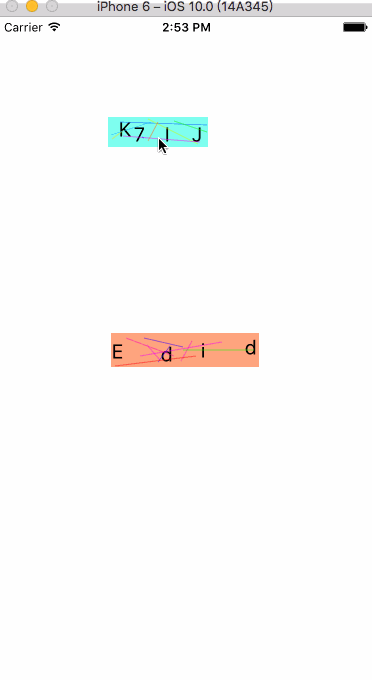

# RandomAuthCode
Local authentication code generation -- OC

<html>
<body>
<h2>什么是RandomAuthCode</h2>

本地验证码的生成

swift链接：https://github.com/zhanghongdou/RandomAuthCode-Swift.git

<h2>效果图展示</h2>

<h3>效果图1</h3>

<h2>使用方法</h2>

详见demo

</body>

</html>